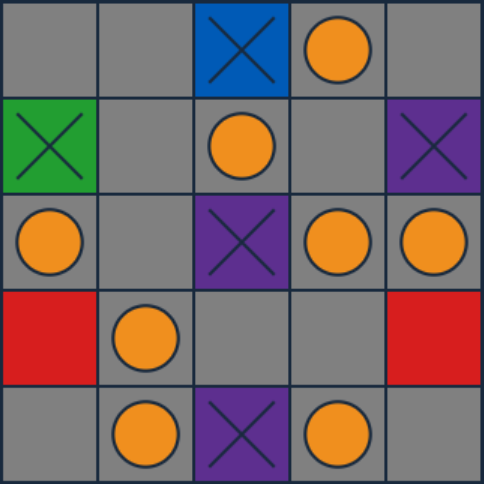

# TokenPuzzle
Puzzle Game Written In JavaScript

Put tokens on grey squares by the following rules:

- Exactly four tokens around each red square

- Exactly three tokens around each purple square

- Exactly two tokens around each blue square

- Exactly one token around each green square

[Play Token Puzzle](https://mezoka.github.io/TokenPuzzle)
